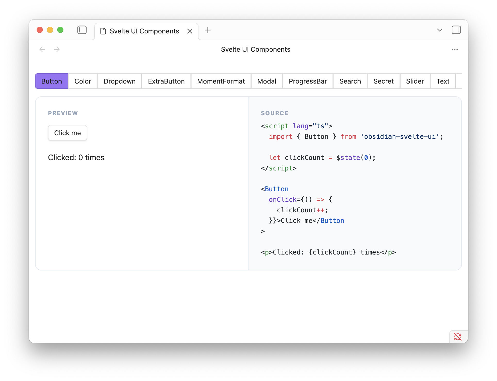

# `obsidian-svelte-ui` Demo Plugin

This Obsidian plugin provides a demo of all of `obsidian-svelte-ui`'s behavior

## Features

### Component Demos

Each of the components has a bespoke demonstration that can be found [here](./src/demos/).

To browse this within `demo-vault`, run the command `"Demo Obsidian Svelte UI: Open component demo"`



### Example View Implementation

[`view.ts`](./src/view.ts) demonstrates populating an Obsidian view by mounting a Svelte component.

### Example Settings Implementation

[`settings.ts`](./src/settings.ts) demonstrates populating an Obsidian Settings panel by mounting a Svelte component.

## Running this Locally

1. Clone this repo
2. Build library and plugin
    ```sh
    cd path/to/clone
    pnpm build
    ```
3. Open the `demo-vault` in Obsidian
